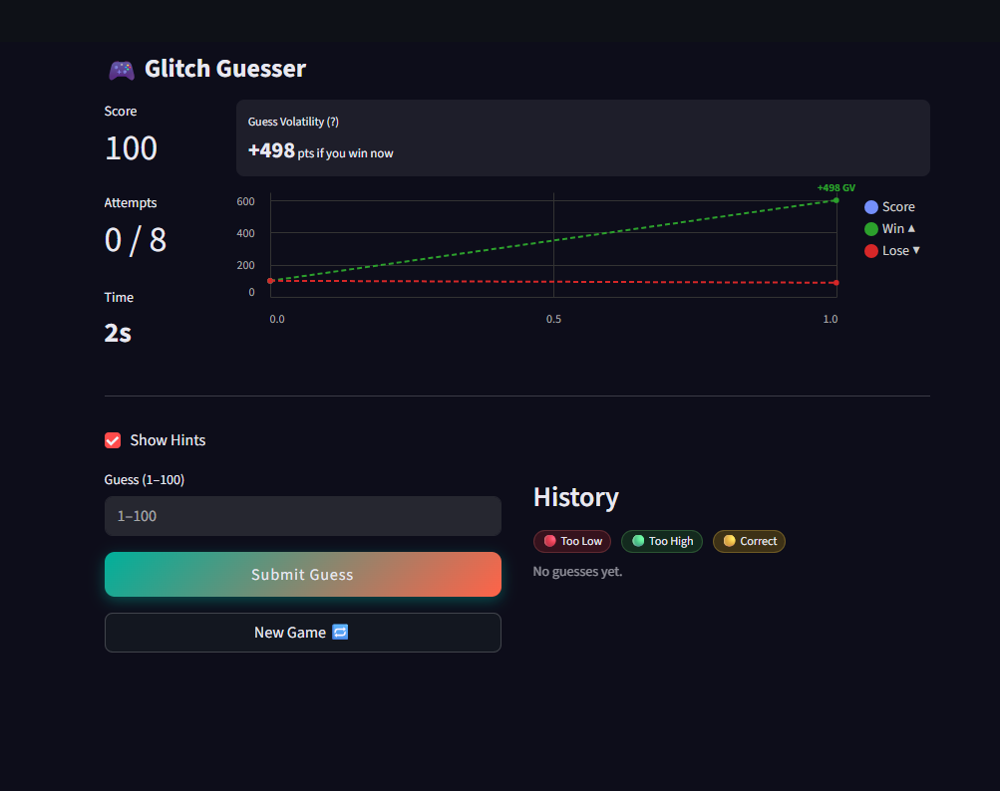
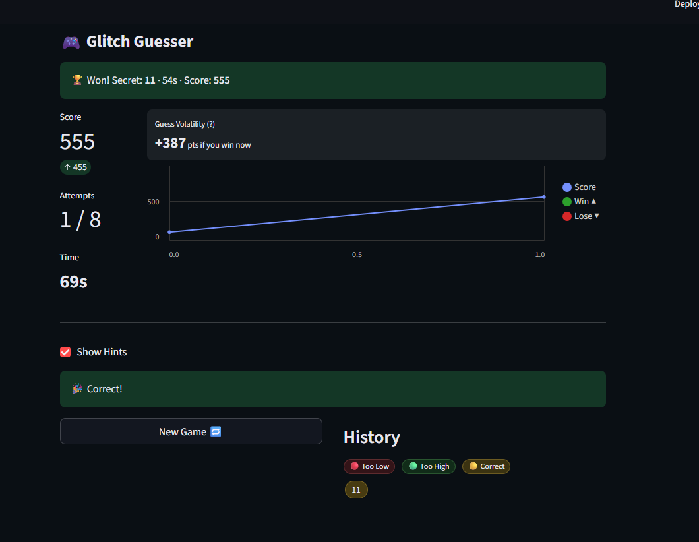
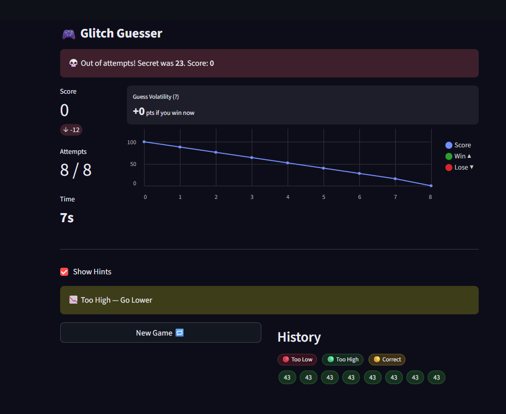

# 🎮 Game Glitch Investigator: The Impossible Guesser

## 🚨 The Situation

You asked an AI to build a simple "Number Guessing Game" using Streamlit.
It wrote the code, ran away, and now the game is unplayable. 

- You can't win.
- The hints lie to you.
- The secret number seems to have commitment issues.

## 🛠️ Setup

1. Install dependencies: `pip install -r requirements.txt`
2. Run the broken app: `python -m streamlit run app.py`

## 🕵️‍♂️ Your Mission

1. **Play the game.** Open the "Developer Debug Info" tab in the app to see the secret number. Try to win.
2. **Find the State Bug.** Why does the secret number change every time you click "Submit"? Ask ChatGPT: *"How do I keep a variable from resetting in Streamlit when I click a button?"*
3. **Fix the Logic.** The hints ("Higher/Lower") are wrong. Fix them.
4. **Refactor & Test.** - Move the logic into `logic_utils.py`.
   - Run `pytest` in your terminal.
   - Keep fixing until all tests pass!

## 📝 Document Your Experience

- [ ] Describe the game's purpose.
The user tries to guess a secret number
User gets hints if they guessed a number lower, the hint lets them no to guess higher, and vice versa
The user wins if he guesses the number correctly within the attempts 

ADDED FEATURES
Added an GV (guess volatilty) which is calcualted based on the attempt and time. The faster the user can guess the number the higher the score.

The GV falls off drastically as the user approaches their guess attempt max limit

Added a graphical view of the score that shows, the users potential win score and loss score based on if they guessed it correctly within the next attempt

Added a more modern UI look and feel from the original design

- [ ] Detail which bugs you found.
There were several bugs ranging from, incorrect difficulty values to UI not clearing up issues and more. As well as edge casese where the user is allowed to put in more number than the difficultyd range. Like if normal is from 1 to 100 then if the user guesses 105 it shouldnt count as its invalid. 

- [ ] Explain what fixes you applied.
I have applied fixes that checked for these UI related issues as well as implemented validation and edge case resolution. With the AI contribution i was also able to ensure code integrity and branch isolation via tasks to ensure changes can be undone. Also following industry standards so no code is pushed directly to main without PRs. 

## 📸 Demo
1. Game start view

2. Game Win (First guess higher score) 

3. Game Lose

## 🚀 Stretch Features

- [ ] [If you choose to complete Challenge 4, insert a screenshot of your Enhanced Game UI here]

1. Game start view

2. Game Win (First guess higher score) 

3. Game Lose

